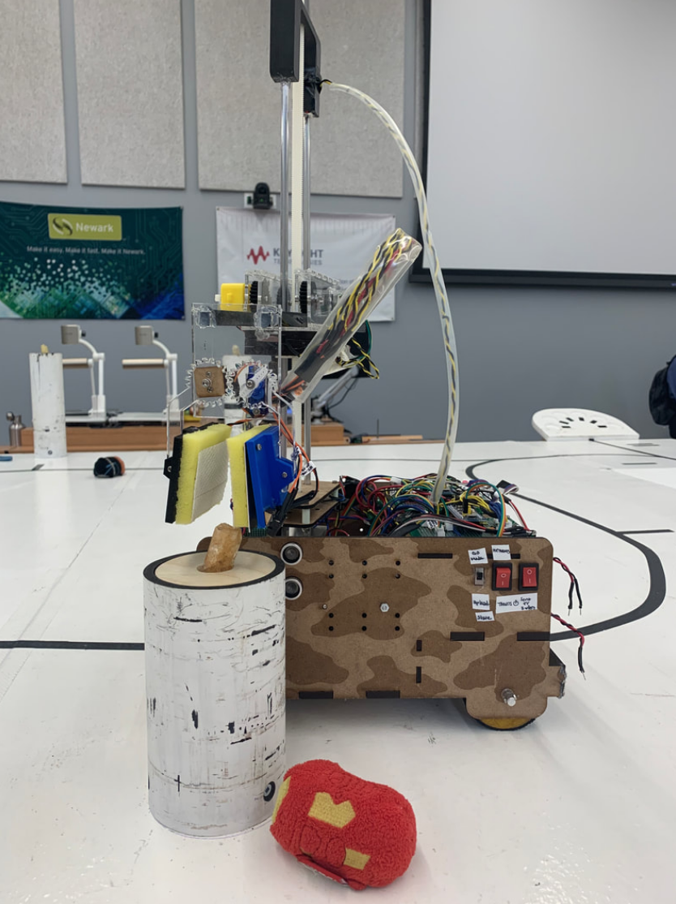
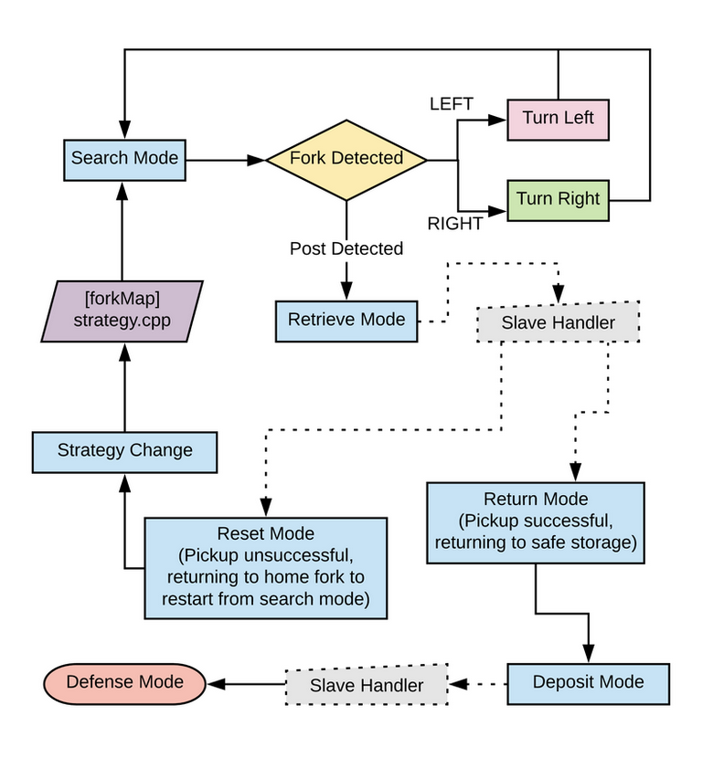

# ENPH_253_BIIF
We designed Beef as part of the Engineering Physics 253 Robot Course. Our robot was tasked with autonomously navigating a course to collect and safely deposit Infinity Stones - all while racing against another robot trying to do the same thing! To see more, please visit https://beefrobot.weebly.com/ 

_Figure 1:_ Our robot on the competition course.

By implementing a state machine, Beef is able to react autonomously to different events occuring in its surrounding environment - whether that be needing to turn, detecting posts, retrieving infinity stones, or navigating back home.

_Figure 2: Beef's state machine._

